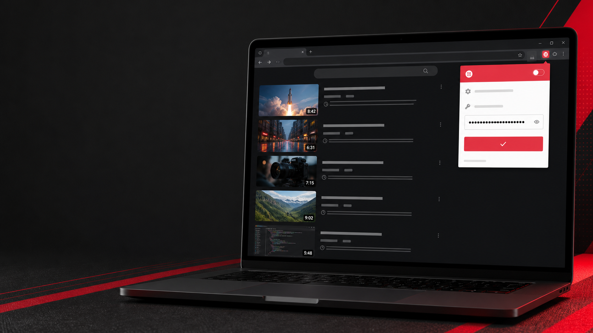
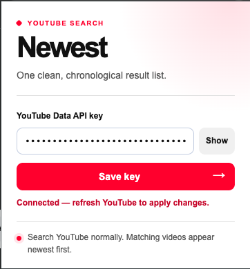

# Newest for YouTube

A local Chrome extension that turns a YouTube search into a chronological list of matching videos. It uses the YouTube Data API's `order=date` search option and preserves YouTube-style result cards.

## Install locally

1. Download or clone this repository.
2. Open `chrome://extensions` in Chrome.
3. Enable **Developer mode**.
4. Click **Load unpacked** and select this repository folder.
5. Click the extension icon in Chrome's toolbar.

## Add your own API key

1. Create a Google Cloud project.
2. Enable **YouTube Data API v3**.
3. Create an API key and restrict it to **YouTube Data API v3**.
4. Click the Newest extension icon, paste the key, and select **Save key**.
5. Refresh a YouTube search-results page.

The key is stored in Chrome's local extension storage on your computer. It is never included in this repository.

## How it works

The extension requests public video search results with `type=video` and `order=date`. The first API page contains the newest matching videos; later pages would be older. New uploads may take a short time to be indexed by YouTube.

## Notes

- This is an unpacked personal-use extension, not a Chrome Web Store listing.
- YouTube Data API quota limits apply.
- Never commit an API key. If one is exposed, revoke it in Google Cloud and create a replacement.
